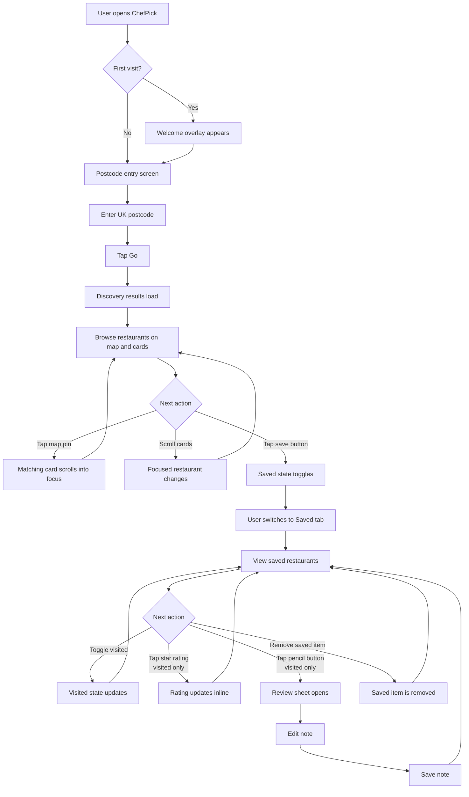
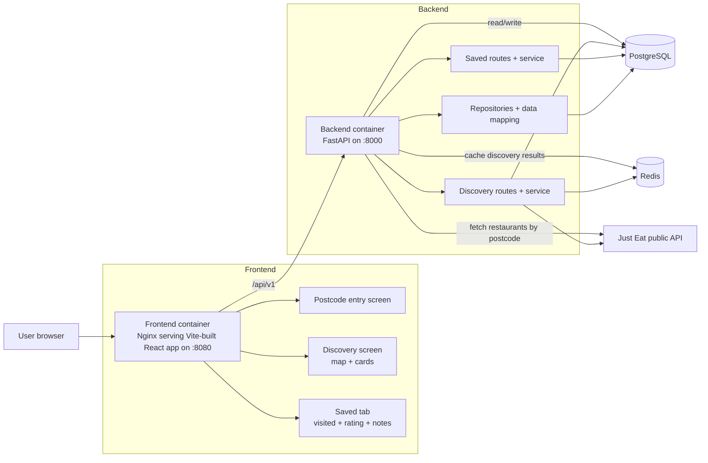

## ChefPick

A full-stack restaurant discovery app built against the Just Eat public API.

### The brief

Take a UK postcode, call the Just Eat API, filter to restaurant data, show the first 10 results with name, cuisines, rating, and address.

This does that, but presents the results as a map plus card view instead of a plain list, and adds a Saved tab for keeping restaurants, marking them visited, and adding notes.

### Customer flow



### Repo layout

```
.
├── frontend-jet/        # React + Vite frontend
├── backend-jet/         # FastAPI backend
├── docker-compose.yml
└── README.md
```

### Tech

**Frontend:** React 18, TypeScript 5, Vite 5, Tailwind 3, TanStack Query 5, React Router 6, Leaflet, Vitest + Testing Library.

**Backend:** FastAPI, SQLAlchemy async, PostgreSQL, Redis, Alembic.

### Running it

You need Docker and the Docker Compose plugin. From the repo root:

```
docker compose up -d --build
docker compose exec backend alembic upgrade head
```

Then:

- Frontend: http://localhost:8080
- Backend health: http://localhost:8000/api/v1/health

To stop: `docker compose down`. To stop and wipe the database: `docker compose down -v`.

If you want to run the frontend outside Docker, you'll need Node 18+ and npm, then `cd frontend-jet && npm install && npm run dev`.

### Tests

Unit tests cover backend API routes, the postcode discovery flow, and service, repository, and startup behavior on the backend. On the frontend, they cover a focused subset: the API client, the postcode entry page, and the restaurant card.

```
# backend
docker compose --profile test run --rm backend-test

# frontend
docker compose --profile test run --rm frontend-test npm test

# production build check
docker compose --profile test run --rm frontend-test npm run build

# typecheck
docker compose --profile test run --rm frontend-test npx tsc --noEmit
```

Lint runs locally: `cd frontend-jet && npm install && npm run lint`.

### Design choices



The brief is small, so the goal was to hit it cleanly without inflating the project.

**Required fields are always visible.** Name, cuisines, rating, and address are on every card in the default state. Nothing the assignment asks for is hidden behind a tap or a hover.

**Split frontend and backend.** The frontend handles UI only. The backend owns the Just Eat call, caching, persistence, business rules, and the stable contract the frontend talks to. The point is that the frontend shouldn't know or care how upstream data is shaped or fetched, it just consumes a clean internal API.

**Redis for postcode caching.** Same postcode searched twice within the cache window skips the upstream call. It's wired through the Docker setup and the backend service layer, so it's part of the design rather than a bolt-on, and it reflects how this would be built if it had to handle real traffic, which was the goal of implementing this feature, imitate and simulate real world solution and architecture.

**Postgres as source of truth for saved data.** Saved restaurants are stored as a snapshot of the restaurant at the moment of save, not re-fetched from Just Eat afterwards. This is the most opinionated call in the project and it matters: the Saved tab stays consistent even if Just Eat's data shifts later, which keeps a user's notes and visited marks anchored to the restaurant they actually saved.

### Assumptions

**"First 10 restaurants returned"**, taken literally. The backend returns the first 10 from the Just Eat response after filtering, without re-ranking.

**Just Eat discovery is the only upstream source.** I didn't build separate endpoints for menus, checkout, contact details, or full restaurant pages. The scope is discovery plus the four required fields, plus the saved-restaurant features layered on top.

**Interface format was open.** I built a mobile-first web app rather than a console or desktop list. This fits the use case of such application better.

**Persistence wasn't required.** Saved restaurants, visited state, and notes are extras, not part of the base requirement.

**No auth.** Single-user, local. Auth would have added setup without improving what's being assessed.

### Trade-offs

The main thing to get wrong here was overbuilding and burying the required fields. I kept the default card state focused on the four assignment fields and pushed everything else (saving, notes, visited state) to secondary actions.

The save-as-snapshot decision has a real trade-off: saved cards can go stale if a restaurant's cuisines or address change on Just Eat's side. I picked stability over freshness because the Saved tab is where the user has invested effort, and having that view mutate underneath them would be worse than slightly outdated metadata.

### What I'd do next

Add end-to-end tests for the core journeys: search, save, visited toggle, note update. Unit coverage hits the pieces but not the flows.

Broaden frontend unit coverage beyond the API client, postcode entry page, and restaurant card.

Tighten the backend test docs. Commands work but the expected env isn't as explicit as it should be.

Production-grade ops: stricter env validation, better healthchecks, deploy-specific config. I kept the setup focused on local reproducibility for the take-home.

UI polish: spacing, motion, smaller interaction details. Functional but not finished.

### One note on the repo

The git history here doesn't reflect the full development process. I hit issues with the original repo partway through and moved the latest working version into a fresh one, so the commits are compressed rather than incremental.
